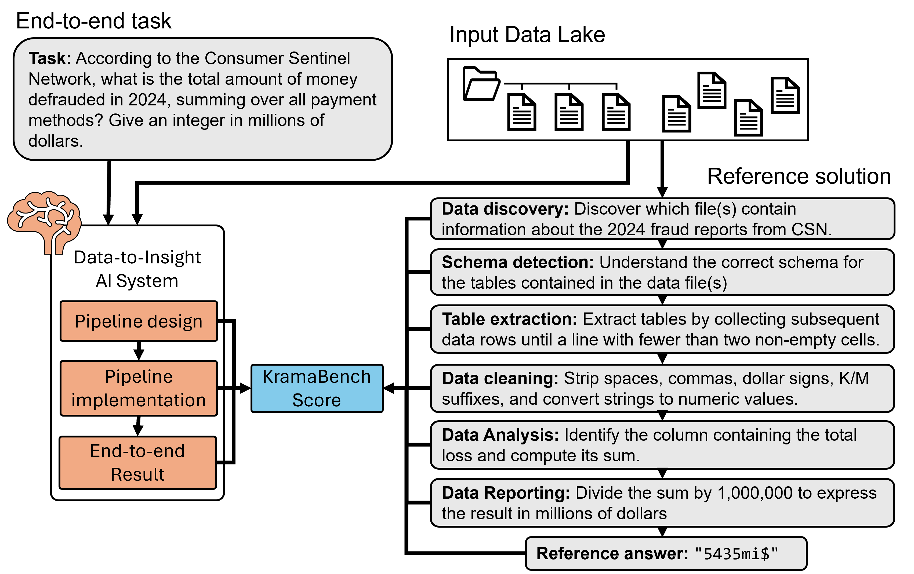

# KramaBench
*KramaBench* is an open-source benchmark for **end-to-end data-science agents**.
Unlike question-answer–only corpora, each task in KramaBench asks a system to build a *complete* data pipeline: load raw files, clean them, transform them, and compute a final answer.
Because ground-truth code is provided, KramaBench can evaluate both the **quality of the final answer** *and* the **correctness of intermediate steps**.



### Systems leaderboard
Overall evaluation results by domain for KramaBench:

| Variant                       | Model            | Archaeology | Astronomy | Biomedical | Environment | Legal | Wildfire | **Overall** |
| ----------------------------- | ---------------- | ----------: | --------: | ---------: | ----------: | ------: | -------: | ----------: |
| **Naive**                     | GPT-o3           | 25% | 1.73% | 3.50% | 1.35% | 3.35 % | 24.87 % | **9.64 %** |
|                               | GPT-4o           | 0.00% | 1.41% | 1.98% | 0.45% | 1.46 % | 1.45 % | **1.62 %** |
|                              | Claude-3.5       | 16.67% | 1.62% | 2.87% | 1.17% | 7.33 % | 13.63 % | **7.45 %** |
|                              | Llama-3 Instruct | 0.00% | 1.43% | 1.70% | 0.98% | 1.37 % | 1.44 % | **1.19 %** |
|                              | DeepSeek-R1      | 0.00% | 1.50% | 2.49% | 2.60% | 1.61 % | 6.46 % | **3.14 %** |
|                              | Qwen-2 Coder     | 0.00% | 1.37% | 2.02% | 1.07% | 1.44 % | 13.68 % | **3.72 %** |
| **DS-GURU (simple)**          | GPT-o3           | 25% | 3.00% | 8.63% | 7.66% | 19.15 % | 45.95 % | **20.80 %** |
|                              | GPT-4o           | 8.33% | 1.40% | 9.38% | 2.60% | 2.74 % | 19.39 % | **7.61 %** |
|                              | Claude-3.5       | 0.00% | 4.15% | 2.15% | 6.21% | 6.68 % | 34.99 % | **10.85 %** |
|                              | Llama-3 Instruct | 0.00% | 1.42% | 10.38% | 0.98% | 5.48 % | 9.81 % | **4.81 %** |
|                              | DeepSeek-R1      | 0.00% | 1.57% | 3.39% | 2.60% | 8.30 % | 14.81 % | **6.35 %** |
|                              | Qwen-2 Coder     | 0.00% | 1.36% | 2.22% | 12.59% | 1.15 % | 16.48 % | **6.43 %** |
| **DS-GURU (self-correcting)** | GPT-o3           | 25% | 3.53% | 8.95% | 19.60% | 13.89 % | 50.73 % | **22.08 %** |
|                              | GPT-4o           | 16.67% | 2.76% | 8.97% | 2.60% | 2.80 % | 17.18 % | **8.28 %** |
|                              | Claude-3.5       | 16.67% | 1.52% | 1.96% | 11.21% | 7.01 % | 39.16 % | **14.35 %** |
|                              | Llama-3 Instruct | 0.00% | 1.35% | 6.98% | 0.93% | 2.15 % | 14.49 % | **4.48 %** |
|                              | DeepSeek-R1      | 8.33% | 2.64% | 2.87% | 19.08% | 8.39 % | 30.29 % | **6.34 %** |
|                              | Qwen-2 Coder     | 8.33% | 2.40% | 4.35% | 12.64% | 9.06 % | 16.48 % | **9.98 %** |


## Breakdown of tasks per domain

| Domain      |  #Tasks | #Sub-tasks | % “Hard” | File count |   Raw size |
| ----------- | ------: | ---------: | ---------: | ---------: | ---------: |
| Archaeology |      12 |         71 |       50 % |          5 |     7.5 MB |
| Astronomy   |      12 |         68 |       50 % |      1 556 |     486 MB |
| Biomedical  |       9 |         38 |       67 % |          7 |     175 MB |
| Environment |      20 |        148 |       70 % |         37 |      31 MB |
| Legal       |      30 |        188 |       53 % |        136 |     1.3 MB |
| Wildfire    |      21 |        120 |       71 % |         23 |       1 GB |
| **Total**   | **104** |    **633** |   **61 %** |      1 764 | **1.7 GB** |

Hard tasks are tasks whose end-to-end solution requires advanced wrangling and transformation steps.

### What does a task look like?

1. **Natural-language prompt** (e.g. *“What is the average Potassium in ppm from the first and last time the study recorded people in the Maltese area?”*).
2. **Reference pipeline** broken into • *key functionalities* and • *natural-language sub-tasks* that test those functionalities individually.

---

### Structure of the repository

The main benchmark repository contains the following folders:
- `benchmark`: This folder contains the code to run the benchmark.
- `data`: This folder contains the input data to be used in solving the benchmark.
- `quickstart`: This folder contains the code for a quickstart example.
- `results`: This folder contains the output data from the different systems under test, produced while running benchmark.
- `scripts`: This folder contains helper scripts.
- `systems`: This folder contains the code to execute the different systems under test.
- `utils`: This folder contains utility code and helper scripts.
- `workload`: This folder contains the questions of the benchmark in JSON format.

## Installation

```bash
git clone https://github.com/<you>/KramaBench.git
cd KramaBench

# create env & install deps
python -m venv .venv
source .venv/bin/activate
pip install -r requirements.txt   # numpy, pandas, tqdm, openai-sdk, …
```

## Quick-start — run the benchmark

The **evaluation harness** is a single script:

```bash
python evaluate.py \
  --sut YourSUT            \  # label for this run
  --dataset_name legal          \  # domain to test
  --workload_filename legal.json \
  --verbose
```

Key CLI flags (see `--help`):

| Flag                  | Default                       | Purpose                                                    |
| --------------------- | ----------------------------- | ---------------------------------------------------------- |
| `--sut`               | `YourSUT` | Arbitrary name for your System Under Test (SUT).           |
| `--dataset_name`      | `legal`                       | Must match the domain contained in the workload file.      |
| `--workload_filename` | `legal.json`             | Which set of tasks to execute.                             |
| `--use_system_cache`  | *(false)*                     | Re-use previous system outputs if they exist.              |
| `--skip_subtasks`     | *(false)*                     | Evaluate only the final answer (faster, but less insight). |

`evaluate.py` produces:

```
results/<SUT>/<workload>_measures_<timestamp>.csv   # fine-grained metrics
results/aggregated_results.csv                      # one-row-per-domain summary
```

---

## Writing your own System Under Test (SUT)

1. **Implement a Python class** that, given
   `dataset_directory` and the JSON prompt, returns either:

   * the final answer, **or**
   * executable Python that produces the answer (recommended; lets the harness inspect intermediate values).
2. Place any temporary files under the path passed to you (`system_output_directory`).
3. Make your class importable by `benchmark/Benchmark`; then run `evaluate.py --sut YourClassName`.

---

## Scoring & metrics

For every task the harness logs:

* **Exact-match metrics**: BLEU & ROUGE for strings mean-relative-absolute-error for numerics.
* **LLM code-eval**: unit tests auto-generated from sub-task ground truth.
* **Bootstrapped rubric** that rewards partial credit when the model paraphrases the correct idea.

Aggregation logic lives in `aggregate_results()` inside `evaluate.py`.

---

## Baseline : DS-GURU

DS-GURU is a minimalist agent that:

1. **Samples rows** from every file in the domain lake.
2. Prompts an LLM with the task, the sample, and strict instructions on cleaning/typing.
3. **Executes** the generated Python, sending back errors/output to the LLM for one retry loop.&#x20;

---

## Citing KramaBench

If you use KramaBench in academic work, please cite the preprint:

```
@misc{lai2025KramaBench,
  title  = {KramaBench: Evaluating End-to-End Data-Science Agents},
  author = {Eugenie Lai and Gerardo Vitagliano and Ziyu Zhang and *et al.*},
  year   = {2025},
}
```

---

### Task structure

The structure of any task inside the `{domain}.json` file is the following:

```json
[
    {   "id": "{dataset-id}-{difficulty}-1",
        "query": "...",
        "answer": "...",
        "answer_type": "...",
        "data_sources": ["...", "..."],
        "subtasks":[{
            "..."
        }]
    }
]
``` 